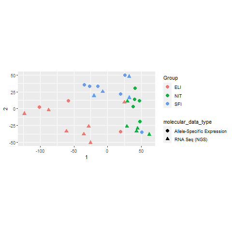
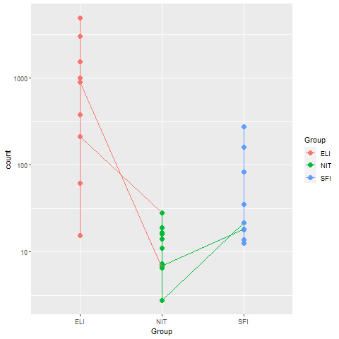

```{r setup, include=FALSE}
knitr::opts_chunk$set(
	echo = FALSE,
	message = FALSE,
	warning = FALSE,
	cache = FALSE,
	comment = NA,
	fig_caption = TRUE,
	prompt = TRUE,
	tidy.opts=list(width.cutoff=60),tidy=TRUE,
	fig.pos = 'H',
	fig.align = "center")
r = getOption("repos")
r["CRAN"] = "http://cran.us.r-project.org"
options(repos = r)

if(!(require(printr))) {
  install.packages(
    'printr',
    type = 'source',
    repos = c('http://yihui.name/xran', 'http://cran.rstudio.com')
  )
}
if (!requireNamespace("BiocManager", quietly = TRUE))
    install.packages("BiocManager")
install.packages("colorspace")
install.packages("gplots")
install.packages("ggplot2")
install.packages("ggrepel")
install.packages("float")
if(!require(airway)) BiocManager::install("airway")
if(!require(Rsamtools)) BiocManager::install("Rsamtools")
if(!require(GenomicFeatures)) BiocManager::install("GenomicFeatures")
if(!require(DESeq2)) BiocManager::install("DESeq2")
if(!require(apeglm)) BiocManager::install("apeglm")
if(!require(BiocParallel)) BiocManager::install("BiocParallel")
if(!require(genefilter)) BiocManager::install("genefilter")
if(!require(org.Hs.eg.db)) BiocManager::install("org.Hs.eg.db")
if(!require(AnnotationDbi)) BiocManager::install("AnnotationDbi")
if(!require(ReportingTools)) BiocManager::install("ReportingTools")
if(!require(RUVSeq)) BiocManager::install("RUVSeq")
if(!require(sva)) BiocManager::install("sva")
if(!require(Gviz)) BiocManager::install("Gviz")
if(!require(magrittr)) install.packages("magrittr", dep=TRUE)
if(!require(dplyr)) install.packages("dplyr", dep=TRUE)
if(!require(pheatmap)) install.packages("pheatmap", dep=TRUE)
if(!require(RColorBrewer)) install.packages("RColorBrewer", dep=TRUE)
if(!require(ggbeeswarm)) install.packages("ggbeeswarm", dep=TRUE)
if(!require(clusterProfiler)) install.packages("clusterProfiler", dep=TRUE)
```


```{r CreateFolders, eval=FALSE, warning=TRUE, include=FALSE}
#Activar chunk si se quiere replicar el experimento con los mismos directorios aquí empleados
setwd(".")
dir.create("data")
dir.create("results")
dir.create("figures")
```


# Abstract

El presente informe contiene el estudio de los resultados del análisis RNA-Seq a muestras de tejido tiroideo. Se comparan tres tipos de infiltración (NIT, SFI y ELI) y se muestran resultados de expresión diferencial en dichas comparaciones. Con los genes diferencialmente expresados, se realiza un análisis de significación biológica.

Para la reproducción del análisis aquí realizado, el código R empleado se encuentra en el siguiente repositorio [**Github**](https://github.com/SoniaD89/ADO2)

# Introducción
```{r Lectura datos, include=FALSE}
#Cargo targets
m.file <- ifelse(params$folder.data=="", 
                 params$file1,
                 file.path(params$folder.data,params$file1))
targets <- read.csv(file=m.file, sep = ",")

#Cargo counts
m.file <- ifelse(params$folder.data=="", 
                 params$file2,
                 file.path(params$folder.data,params$file2))
counts <- read.csv(file=m.file, sep = ";", row.names = "X") 

```


El archivo `r params$file1` contiene la información de las muestras de un estudio obtenido del repositorio (GTEx1). Este repositorio contiene datos de múltiples tipos en un total de 54 tejidos. Nosotros nos centraremos en los datos de expresión (RNA-seq) pertenecientes a un análisis del tiroides en donde se compara tres tipos de infiltración medido en un total de `r nrow(targets)`muestras pertenecientes a tres grupos:


• Not infiltrated tissues (NIT)

• Small focal infiltrates (SFI)

• Extensive lymphoid infiltrates (ELI)

También se proporciona el archivo `r params$file2`, que contiene el conteo de `r nrow(counts)` genes para las `r ncol(counts)` muestras. 

Al desconocer los detalles del estudio de referencia, a la hora de elegir umbrales se han seleccionado los comúnmente aceptados o dejado los valores por defecto de las funciones empleadas. Se asume también que los individuos muestreados son humanos. En este informe se incluyen sólo las informaciones que se consideran relevantes para evaluar las comparaciones solicitadas. Más información, incluyendo figuras adicionales, puede encontrarse en el repositorio Github mencionado anteriormente. 

# Métodos

Para el informe se han utilizado los archivos `r params$file1` y `r params$file2`. De entre las `r nrow(targets)`muestras, se han seleccionado las 30 muestras solicitadas por el enunciado, 10 de cada tipo. Se realizarán tres comparaciones, ELI vs NIT (EvsN), ELI vs SFI (EvsS) y SFI vs NIT (SvsN).


```{r muestreo, include=FALSE}
set.seed(params$valor.seed)

#Selecciono subset del grupo NIT
NIT <- which(targets$Group=="NIT")
#De ese subset, muestreo 10
nit<-targets[ sample(NIT,10), ]
#Repito con el resto de grupos
ELI <- which(targets$Group=="ELI")
eli<-targets[ sample(ELI,10), ]
SFI <- which(targets$Group=="SFI")
sfi<-targets[ sample(SFI,10), ]
```

## Tratamiento de los datos

El primer paso será unir esas 10 muestras de cada grupo en una única tabla que contenga los conteos del conjunto de 30 muestras. Para ello, se unifican los nombres de muestras de los archivos `r params$file1` y `r params$file2`. Después, se elabora una tabla que contenga las columnas de `r params$file2` cuyo encabezamiento coincida con el nombre de las muestras escogidas de la tabla de `r params$file1`. 

```{r}
targets$Sample_Name<-gsub('-', '.', targets$Sample_Name)
#Cambio guiones por puntos para que coincidan los nombres de la muestra con los nombres de las columnas del archivo counts. De este modo evito modificar el archivo original
nit$Sample_Name <-  gsub('-', '.', nit$Sample_Name)
eli$Sample_Name <-  gsub('-', '.', eli$Sample_Name)
sfi$Sample_Name <-  gsub('-', '.', sfi$Sample_Name)
```

```{r escojo counts, include=FALSE}
library(dplyr)
#elijo columnas de count que tengan los nombres de las muestras seleccionadas
elic <- counts %>% dplyr:: select(starts_with(eli$Sample_Name))
nitc<- counts %>% dplyr:: select(starts_with(nit$Sample_Name))
sfic <- counts %>% dplyr:: select(starts_with(sfi$Sample_Name))
```
```{r uno los subsets, include=FALSE}
#Uno los tres subsets 
conteo <- cbind(elic,nitc)
conteo <- cbind (conteo,sfic)
```

Para añadir la información de la tabla `r params$file1` en el nuevo elemento creado (llamado `conteo`), se selecciona dicha información sólo de las muestras seleccionadas y se crea una nueva tabla (llamada `infotargets`). Esta tabla será la utilizada como `colData`  en la función `DESeqDataSetFromMatrix` del paquete `DESeq2` para crear el objeto `DESeqDataSet`, necesario para continuar el análisis. 

```{r include=FALSE}
#Creo tabla targets con sólo la info de las muestras seleccionadas
infotarget <- rbind(eli,nit)
infotarget <- rbind(infotarget,sfi)
```

```{r message=FALSE, include=FALSE}
library(DESeq2)
dds <- DESeqDataSetFromMatrix(countData = conteo,
                                  colData = infotarget,
                                  design = ~ Group)
dds
#Añado columna de metadata con nombres de genes
featureData <- data.frame(gene=rownames(conteo))
mcols(dds) <- DataFrame(mcols(dds), featureData)
```


```{r}
#Elimino conteos de 0 y 1
dds <- dds[ rowSums(counts(dds)) > 1, ]
```
Para la filtración de los datos, sólo se eliminarán aquellas filas del `DESeqDataSet` que no contengan ningún conteo o tengan uno sólo a lo largo de todas las muestras. No se filtrará a mayores al no tener conocimiento de los detalles del estudio de referencia, por lo que se opta por la opción con la que se pierde el mínimo de información. Tras realizar esta operación, quedan `r nrow(dds)` genes.

Los valores de la matriz de conteo no se han normalizado ya que el modelo del paquete `DeSeq2` supone que los datos introducidos son los datos obtenidos en el experimento, en forma de una matriz numérica. 


### Transformación de los datos

Para una mejor visualización de los resultados se realiza una transformación de los datos. Se ha empleado la función `vst`, que devuelve un objeto `DESeqTransform`. Los datos transformados ya no son un conteo,  se almacenan en el slot `assay`, y se sigue pudiendo acceder a la información de `colData`. A continuación se muestran dos gráficos con diferentes transformaciones, log2 y `VST`. Se ha escogido `VST` porque, como puede observarse, en este caso se comprimen las diferencias con genes con un conteo bajo, para los cuales los datos no ofrecen mucha información sobre su expresión diferencial. 


```{r include=FALSE}

vsd <- vst(dds, blind = FALSE)
head(assay(vsd), 3)
colData(vsd)
```


```{r}
library("dplyr")
library("ggplot2")
library("ggrepel")
dds <- estimateSizeFactors(dds)

```
```{r grafico transformaciones, include=FALSE}
png("figures/transformaciones.png", res = 150, width = 7, height = 7, units = 'in')
df <- bind_rows(
  as_data_frame(log2(counts(dds, normalized=TRUE)[, 1:2]+1)) %>%
         mutate(transformation = "log2(x + 1)"),
  as_data_frame(assay(vsd)[, 1:2]) %>% mutate(transformation = "vst"))
  
colnames(df)[1:2] <- c("x", "y")  
ggplot(df, aes(x = x, y = y)) + geom_hex(bins = 80) +
  coord_fixed() + facet_grid( . ~ transformation)
dev.off()
```

```{r transf, fig.align='center', fig.cap="Transformaciones de los datos según los métodos log2 (izq) y VST (dcha)", fig.height=4, fig.width=6, message=FALSE}

#Aquí se ha utilizado una pequeña trampa que se repetirá a lo largo del informe en momentos puntuales. Por problemas no identificados con knitr y mikTex, algunos gráficos no se representan como debieran. Lo que aquí se ha hecho es generar el gráfico utilizando el código con RStudio, y guardar esa imagen con un 1 al final (en este caso, "transformaciones1"). Entonces en este informe, al producir el archivo pdf, se llama a esa imagen ya creada y no a la creada por knitr. 
```

## Sample distances

En caso de que fuese práctico conocer las diferencias de unas muestras respecto a otras, se incluye un mapa de calor con las distancias intermuestrales. 
```{r}
sampleDists <- dist(t(assay(vsd)))
```

```{r heatmapsave, include=FALSE}
library("pheatmap")
library("RColorBrewer")
png("figures/heatmapvsd.png", res = 150, width = 5, height = 5, units = 'in')
sampleDistMatrix <- as.matrix( sampleDists )
rownames(sampleDistMatrix) <- paste( vsd$Group, vsd$molecular_data_type, sep = " - " )
colnames(sampleDistMatrix) <- NULL
colors <- colorRampPalette( rev(brewer.pal(9, "Reds")) )(255)
pheatmap(sampleDistMatrix,
         clustering_distance_rows = sampleDists,
         clustering_distance_cols = sampleDists,
         col = colors)
dev.off()
```

```{r heatmapdist, fig.cap="Heatmap de las distancias entre las muestras, basados en los datos transformados por el método VST",message=FALSE, fig.align='center'}

```


## PCA 

  Se realizó un análisis de componentes principales, cuyo resultado puede verse en la Figura  \@ref(fig:plotPCA) y se añade un gráfico MDS que ayuda a la interpretación de los datos de distancias entre muestras (Figura \@ref(fig:MDS) ).

```{r plotPCAsave, include=FALSE}
png("figures/plotPCA.png", res = 300, width = 1800, height =1800)
plotPCA(vsd, intgroup = c("Group", "molecular_data_type"))
dev.off()
```
```{r plotPCA, fig.cap="PCA plot usando los datos VST. Cada combinación de tratamiento y sexo tiene un color único", fig.align="center", echo=FALSE}

```

En el análisis de los componentes principales (PCA) se observa que el primer componente del PCA es responsable del 58% de la variabilidad de las muestras. Como se observa en el gráfico de la figura \@ref(fig:plotPCA), esta variabilidad podría atribuirse ya a los diferentes grupos ELI, NIT y SFI. Esta diferencia es más clara entre las muestras ELI y el resto, sobre todo enrre ELI y NIT. Se muestra también en los gráficos la diferencia entre las muestras *NGS* y *allele-specific expression* para comprobar visualmente que dicha diferencia es despreciable.

```{r MDSsave, include=FALSE}
png("figures/plotMDS.png")
mds <- as.data.frame(colData(vsd))  %>%
         cbind(cmdscale(sampleDistMatrix))
ggplot(mds, aes(x = `1`, y = `2`, color = Group, shape = molecular_data_type)) +
  geom_point(size = 3) + coord_fixed()
dev.off()

```

```{r MDS, fig.cap="MDS plot usando los datos VST. Cada tipo de infiltración tiene un color único y cada tipo de datos tiene una forma única", fig.align='center', fig.width=5, fig.height=5 }

```


## Expresión diferencial 

Para el análisis de la expresión diferencial, se emplea la función `DESeq` sobre los datos **sin transformar**. 

```{r deseq, message=FALSE, warning=FALSE}
dds <- DESeq(dds, parallel =TRUE)
```

Del objeto DESeqDataSet obtenido, se extraen los resultados de interés. En este caso, serán contrastes entre las muestras de diferentes tipos de infiltración dos a dos, como solicita el enunciado (en el orden EvsN, EvsS y SvsN).

```{r resultados contrastes, include=FALSE}
library(dplyr)
dds$Group %>% as.factor() #Transformo variable Group a factor
#Elaboro los contrastes dos a dos solicitados en el enunciado
resen <- results(dds, contrast=c("Group","ELI","NIT"))
mcols(resen, use.names = TRUE)
reses <- results(dds, contrast=c("Group","ELI","SFI"))
mcols(reses, use.names = TRUE)
ressn <- results(dds, contrast=c("Group","SFI","NIT"))
mcols(ressn, use.names = TRUE)
```
```{r sumarios contrastes, eval=FALSE, include=FALSE}
summary(resen)
summary(reses)
summary(ressn)
```

```{r eval=FALSE, include=FALSE}
#Fórmula a utilizar en caso de que se quiera restringir el número de genes considerados significativos. En este informe se deja el 0.1 utilizado por defecto
#res.05 <- results(dds, alpha = 0.05)
#table(res.05$padj < 0.05)
```

# Plot de conteo

En el gráfico \@ref(fig:plotcounts) se observan los conteos del objeto DESeqDataSet para cada uno de los tipos de infiltración. Se incluyen los genes de la comparación EvsN:

```{r countsave, fig.align='center', fig.height=4, fig.width=5, message=FALSE, include=FALSE}
png("figures/counts.png")
topGene <- rownames(resen)[which.min(resen$padj)] #Sólo se realiza con resen al no variar las conclusiones que se pueden obtener con reses y ressn
library("ggbeeswarm")
geneCounts <- plotCounts(dds, gene = topGene, intgroup = c("Group","molecular_data_type"),
                         returnData = TRUE)
ggplot(geneCounts, aes(x = Group, y = count, color = Group, group = molecular_data_type)) +
  scale_y_log10() + geom_point(size = 3) + geom_line()
dev.off()
```

```{r plotcounts, fig.cap="Count plot obtenido para cada uno de lo distintos tipos de infiltración utilizados en el experimento, para los genes incluidos en la comparación EvsN. La gráfica no varía sustancialmente si se incluyen los genes de EvsS y SvsN.", fig.align='center', fig.width=5, fig.height=5}

```


```{r maplot, eval=FALSE, message=FALSE, include=FALSE}
library("apeglm")
resultsNames(dds)
png("figures/maplotEN.png")
#No incluido en informe al no parecer de relevancia (casi todos lo genes se expresan diferencialmente, aparecen en rojo)
maen <- lfcShrink(dds, coef="Group_NIT_vs_ELI", type="apeglm")
plotMA(maen, ylim = c(-5, 5)) 
dev.off()
```


## Anotación de los resultados

Se añaden las anotaciones de ENTREZID, GO y SYMBOL correspondientes a las anotaciones ENSEMBL ya presentes en los datos. Para ello se utiliza la función `mapIDs`del paquete `AnnotationDbi`, y el paquete de anotación `org.Hs.eg.db`. 

```{r message=FALSE, include=FALSE}
library("AnnotationDbi")
library(org.Hs.eg.db)
columns(org.Hs.eg.db)
```

Para buscar correspondencias, se han eliminado las versiones de las anotaciones de ENSEMBL (es decir, toda aquella información del nombre ENSEMBL posterior al punto). A continuación se muestra una parte de los resultados obtenidos para la comparación ELI vs NIT:

```{r}
row.names(resen)=gsub("\\..*","",row.names(resen))
```

```{r anotaciones ELI vs NIST}
#Se utiliza mapIDs tres veces, una por cada nueva notación. La función añade una nueva columna cada vez. Se pide que devuelva el primer resultado que encuentre. Repito para cada una de las tres comparaciones.
resen$symbol <- mapIds(org.Hs.eg.db,
                     keys=row.names(resen),
                     column="SYMBOL",
                     keytype="ENSEMBL",
                     multiVals="first")
resen$entrez <- mapIds(org.Hs.eg.db,
                     keys=row.names(resen),
                     column="ENTREZID",
                     keytype="ENSEMBL",
                     multiVals="first")
resen$GO <- mapIds(org.Hs.eg.db,
                     keys=row.names(resen),
                     column="GO",
                     keytype="ENSEMBL",
                     multiVals="first")
resOrdered <- resen[order(resen$pvalue),]
head(resOrdered)
```
```{r}
row.names(reses)=gsub("\\..*","",row.names(reses))
```
```{r anotaciones ELI vs SFI}
reses$symbol <- mapIds(org.Hs.eg.db,
                     keys=row.names(reses),
                     column="SYMBOL",
                     keytype="ENSEMBL",
                     multiVals="first")
reses$entrez <- mapIds(org.Hs.eg.db,
                     keys=row.names(reses),
                     column="ENTREZID",
                     keytype="ENSEMBL",
                     multiVals="first")
reses$GO <- mapIds(org.Hs.eg.db,
                     keys=row.names(reses),
                     column="GO",
                     keytype="ENSEMBL",
                     multiVals="first")
resesOrdered <- reses[order(reses$pvalue),]
```

```{r}
row.names(ressn)=gsub("\\..*","",row.names(ressn))
```
```{r anotaciones SFI vs NIT}
ressn$symbol <- mapIds(org.Hs.eg.db,
                     keys=row.names(ressn),
                     column="SYMBOL",
                     keytype="ENSEMBL",
                     multiVals="first")
ressn$entrez <- mapIds(org.Hs.eg.db,
                     keys=row.names(ressn),
                     column="ENTREZID",
                     keytype="ENSEMBL",
                     multiVals="first")
ressn$GO <- mapIds(org.Hs.eg.db,
                     keys=row.names(ressn),
                     column="GO",
                     keytype="ENSEMBL",
                     multiVals="first")
ressnOrdered <- ressn[order(ressn$pvalue),]
```


```{r guardar resultados}
#guardo los resultados en .csv para facilitar la consulta y su uso posterior
resEvsN <- as.data.frame(resOrdered)
write.csv(resEvsN, file = "results/resultsELIvsNIT.csv")
resEvsS <- as.data.frame(resesOrdered)
write.csv(resEvsS, file = "results/resultsELIvsSFI.csv")
resSvsN <- as.data.frame(ressnOrdered)
write.csv(resSvsN, file = "results/resultsSFIvsNIT.csv")
```

Los archivos guardados incluyen los genes ordenados según su p-valor. Se incluyen también estadísticos como   `log2FolChange`, `lfcSE` y `padj`, que pueden ser útiles para otras interpretaciones aparte de las aquí presentadas. 

# Enrichment Analysis

Una vez tenemos los genes anotados, procedemos a la visualización de los resultados de la expresión diferencial obtenidos. En este informe se muestran varios ejemplos de visualización. Para mostrar una visión general de la expresión diferencial se realiza un `volcano plot` para cada una de las comparaciones.


```{r volcanosave, include=FALSE}
png("figures/volcanoEvsN.png", res = 80, width = 480, height = 480)
with(resOrdered, plot(log2FoldChange,-log10(pvalue), pch=20, main="Volcano plot ELI vs NIT", xlim=c(-2.5,2)))
# Los genes aparecen coloreados en rojo si padj<0.1)
with(subset(resOrdered, padj<.1 ), points(-log10(pvalue), pch=20, col="red"))
dev.off
png("figures/volcanoEvsS.png", res = 80, width = 480, height = 480)
with(resesOrdered, plot(log2FoldChange,-log10(pvalue), pch=20, main="Volcano plot ELI vs SFI", xlim=c(-2.5,2)))
with(subset(resesOrdered, padj<.1 ), points( -log10(pvalue), pch=20, col="red"))
dev.off()
png("figures/volcanoSvsN.png", res = 80, width = 480, height = 480)
with(ressnOrdered, plot(log2FoldChange, -log10(pvalue), pch=20, main="Volcano plot SFI vs NIT", xlim=c(-2.5,2)))
with(subset(ressnOrdered, padj<.1 ), points(-log10(pvalue), pch=20, col="red"))
dev.off()
```


Por último, para ayudar a interpretar la importancia biológica de los resultados del experimento, se realizó un test `enrichgo` (`Gene  Enrichment Analysis`) mediante el paquete `clusterProfiler` [@clusterprofiler] .  Para representar los resultados de este test, se han utilizado diagramas de barras mediante la función `barplot`, un diagrama en forma de red especificando qué genes son los que actúan mediante la función `cnetplot` y un gráfico `emapplot`.  Se han calculado los resultados para las ontologías `BP`(Biological Process), `CC`(Cellular Component) y `MF` (Molecular Function), para tener una visión más general de la importancia biológica de los resultados.  El criterio de selección de genes diferencialmente expresados ha sido un p-valor ajustado menor de 0.05. Se seleccionan todos los genes que tienen al menos una anotación en la base de datos GO.


```{r}
if (!requireNamespace("BiocManager", quietly = TRUE))
    install.packages("BiocManager")

BiocManager::install("clusterProfiler")
```

```{r include=FALSE}
library(org.Hs.eg.db)
library(clusterProfiler)
library(ensembldb)
library(tidyverse)
```

```{r selectGenes, include=FALSE}
listOfTables <- list(EvsN = resEvsN, 
                     EvsS  = resEvsS, 
                     SvsN = resSvsN)
listOfSelected <- list()
library(org.Hs.eg.db)
for (i in 1:length(listOfTables)){
  # Selecciono toptable
  topTab <- listOfTables[[i]]
  # selecciono los genes a ser añadidos en el análisis
  whichGenes<-topTab["padj"]<0.05
  EntrezIDs <- topTab$entrez[whichGenes]
  listOfSelected[[i]] <- EntrezIDs
  names(listOfSelected)[i] <- names(listOfTables)[i]
}
```
```{r}
listOfData <- listOfSelected[1:3]
```


```{r include=FALSE}
mapped_genes2GO <- mappedkeys(org.Hs.egGO)
mapper_enseml <- mappedkeys(org.Hs.egENSEMBL)
mapped_genes2KEGG <- mappedkeys(org.Hs.egPATH)
mapped_genes <- union(mapped_genes2GO , mapper_enseml)
```


```{r EnrichmentAnalysis, include=FALSE}
#pvaluecutoff aumentado para tener más de un gen en todas las comparaciones
listOfData <- listOfSelected[1:3]
comparisonsNames <- names(listOfData)
universe <- mapped_genes
comparisonsNames
for (i in 1:length(listOfData)){
  genesIn <- listOfData[[i]]
  comparison <- comparisonsNames[i]
  ego <- enrichGO(gene        = genesIn,
                universe      = mapped_genes,
                OrgDb         = org.Hs.eg.db,
                ont           = "CC",
                pAdjustMethod = "BH",
                pvalueCutoff  = 0.2,
        readable      = TRUE)
  cat("##################################")
  cat("\nComparison: ", comparison,"\n")
cat("##################################")
  cat("\nComparison: ", comparison,"\n")
  print(head(ego))

  if (length(rownames(ego@result)) != 0) {
  write.csv(as.data.frame(ego), 
             file =paste0("./results/","CCenrichGO.Results.",comparison,".csv"), 
             row.names = FALSE)
  
  pdf(file=paste0("./figures/","CCenrichGOBarplot.",comparison,".pdf"))
    print(barplot(ego, showCategory = 15, font.size = 4, 
            title = paste0("enrichGO Analysis for ", comparison,". Barplot")))
  dev.off()
  
  png(file = paste0("./figures/","CCenrichGOcnetplot.",comparison,".png"), width = 480, height = 480)
    print(cnetplot(ego, categorySize = "geneNum", schowCategory = 15, 
         vertex.label.cex = 0.75))
  dev.off()
  png(file = paste0("./figures/","CCenrichGOemapplot.",comparison,".png"), res = 150, width = 5, height = 5, units = 'in')
   print(emapplot(ego, categorySize = "geneNum", schowCategory = 15, 
         vertex.label.cex = 0.75))
  dev.off()

  }
}
```

           


```{r enrichBP, include=FALSE}
comparisonsNames <- names(listOfData)
universe <- mapped_genes
comparisonsNames
for (i in 1:length(listOfData)){
  genesIn <- listOfData[[i]]
  comparison <- comparisonsNames[i]
  ego2 <- enrichGO(gene          = genesIn,
                universe      = mapped_genes,
                OrgDb         = org.Hs.eg.db,
                ont           = "BP",
                pAdjustMethod = "BH",
                pvalueCutoff  = 0.05,
        readable      = TRUE)
  cat("##################################")
  cat("\nComparison: ", comparison,"\n")
cat("##################################")
  cat("\nComparison: ", comparison,"\n")
  print(head(ego2))

  if (length(rownames(ego2@result)) != 0) {
  write.csv(as.data.frame(ego2), 
             file =paste0("./results/","BPenrichGO.Results.",comparison,".csv"), 
             row.names = FALSE)
  
  pdf(file=paste0("./figures/","BPenrichGOBarplot.",comparison,".pdf"))
    print(barplot(ego2, showCategory = 15, font.size = 4, 
            title = paste0("enrichGO Analysis for ", comparison,". Barplot")))
  dev.off()
  
  png(file = paste0("./figures/","BPenrichGOcnetplot.",comparison,".png"), res = 150, width = 5, height = 5, units = 'in')
    print(cnetplot(ego2, categorySize = "geneNum", schowCategory = 15, 
         vertex.label.cex = 0.75))
  dev.off()
   png(file = paste0("./figures/","BPenrichGOemapplot.",comparison,".png"), res = 150, width = 5, height = 5, units = 'in')
   print(emapplot(ego2, categorySize = "geneNum", schowCategory = 15, 
         vertex.label.cex = 0.75))
  dev.off()

  }
}
```

```{r ENRICHMENTMF, include=FALSE}
#pvaluecutoff de 0.15 para tener más de un gen en todas las comparaciones
for (i in 1:length(listOfData)){
  genesIn <- listOfData[[i]]
  comparison <- comparisonsNames[i]
  ego3 <- enrichGO(gene          = genesIn,
                OrgDb         = org.Hs.eg.db,
                ont           = "MF",
                pAdjustMethod = "BH",
                pvalueCutoff  = 0.15)
  cat("##################################")
  cat("\nComparison: ", comparison,"\n")
cat("##################################")
  cat("\nComparison: ", comparison,"\n")
  print(head(ego3))
 #guardo los resultados del análisis para cada comparación 
  if (length(rownames(ego3@result)) != 0) {
  write.csv(as.data.frame(ego3), 
             file =paste0("./results/","MFenrichGO.Results.",comparison,".csv"), 
             row.names = FALSE)

  pdf(file=paste0("./figures/","MFenrichGOBarplot.",comparison,".pdf"))
    print(barplot(ego3, showCategory = 15, font.size = 4, 
            title = paste0("enrichGO Analysis for ", comparison,". Barplot")))
  dev.off()
   png(file = paste0("./figures/","MFenrichGOcnetplot.",comparison,".png"), res = 150, width = 5, height = 5, units = 'in')
    print(cnetplot(ego3, categorySize = "geneNum", schowCategory = 15, 
         vertex.label.cex = 0.75))
  dev.off()
   png(file = paste0("./figures/","MFenrichGOemapplot.",comparison,".png"), res = 150, width = 5, height = 5, units = 'in')
   print(emapplot(ego3, categorySize = "geneNum", schowCategory = 15, 
         vertex.label.cex = 0.75))
  dev.off()
  }
}
```


Las figuras resultantes de los análisis han sido guardadas en archivos .png y .pdf por si esta información fuese útil para este u otros estudios. 

# Resultados

Los resultados para cada comparación tras utilizar la función `DESeq` son: 

```{r results DESeq}
print(summary(reses))
print(summary(resen))
print(summary(ressn))
```

En los siguientes plots se observan resaltados en rojo los genes con un p-valor ajustado menor de 0.1 para cada una de las comparaciones. 


```{r volcanos, echo=FALSE, fig.align="center", fig.show="asis", fig.asp=0.5, fig.cap="Volcanoplots para ELI vs NIT, ELI vs SFI y SFI vs NIT. Resaltados aparecen los 4 primeros genes", message=FALSE, fig.pos="H"}

par(mfrow=c(3,3))


```

En la comparación SvsN intervienen una cantidad ligeramente mayor de genes "_down-regulated_", mientras que en las comparaciones EvsN y EvsS ocurre al contrario.


### Resultados del "Gene Enrichment Analysis"

Los genes selecionados para este análisis en cada una de las comparaciones son:

```{r echo=FALSE}
sapply(listOfSelected, length)
```
 
Como la pregunta del estudio no está clara, sólo se muestran aquí los gráficos que a criterio técnico son más fácilmente interpretables.  resultados del análisis realizado con enrichGO para procesos biológicos (Figuras \@ref(fig:cnetplot) y \@ref(fig:emapplot) ):

```{r cnetplot, fig.cap="Network obtenida mediante el análisis enrichGO en la lista obtenida de la comparación entre UvsP1 y UvsP4"}
cnetplot(ego3, categorySize = "geneNum", schowCategory = 15, 
         vertex.label.cex = 0.55)
```

```{r emapplot, fig.cap="'Enrichment Map' mediante el análisis enrichGO en la lista obtenida de la comparación entre UvsP1 y UvsP4"}
emapplot(ego3, cex.label=0.4)
```

# Sumario de resultados

```{r}
Tab.react1 <- read.csv2(file.path("./results/BPenrichGO.Results.EvsN.csv"), 
                       sep = ",", header = TRUE, row.names = 1)
```
```{r}
Tab.react2 <- read.csv2(file.path("./results/BPenrichGO.Results.EvsS.csv"), 
                       sep = ",", header = TRUE, row.names = 1)
```
```{r}
Tab.react3 <- read.csv2(file.path("./results/BPenrichGO.Results.SvsN.csv"), 
                       sep = ",", header = TRUE, row.names = 1)
```
```{r}
nrow(Tab.react1)
nrow(Tab.react2)
nrow(Tab.react3)
```

Para la comparación EvsN, se han encontrado `r nrow(Tab.react1)` procesos biológicos mediante el análisis de "enrichGO", mientras que para EvsS se han encontrado `r nrow(Tab.react2)` y para SvsN `r nrow(Tab.react3)`. Es interesante observar que, aunque la diferencia en el número de procesos biológicos señalados por el análisis es notable entre las comparaciones, en las primeras posiciones comparten la activación de las células T y la regulación de la activación de los linfocitos. En cambio, sólo la comparación SvsN presenta en las primeras posiciones la activación y proliferación de células B (Cuadros 1, 2 y 3).
```{r}
install.packages("kableExtra")
```

```{r tableReacto, echo=FALSE, fig.pos="H"}

library(kableExtra)
Tab.react1 <- Tab.react1[1:4, 1:4]
knitr::kable(Tab.react1, booktabs = TRUE, caption = "Primeras filas y columnas de resultados de enrichGO para la comparación EvsN")%>%
  kable_styling(latex_options = "hold_position")

```
```{r tableReacto2, echo=FALSE, fig.pos="H"}

Tab.react2 <- Tab.react2[1:4, 1:4]
knitr::kable(Tab.react2, booktabs = TRUE, caption = "Primeras filas y columnas de resultados de enrichGO para la comparación EvsS")%>%
  kable_styling(latex_options = "hold_position")

```
```{r tableReacto3, echo=FALSE, fig.pos="H"}

Tab.react3 <- Tab.react3[1:4, 1:4]
knitr::kable(Tab.react3, booktabs = TRUE, caption = "Primeras filas y columnas de resultados de enrichGO para la comparación SvsN")%>%
  kable_styling(latex_options = "hold_position")

```

# Comentarios

En el caso de que las infiltraciones NIT, SFI Y ELI fuesen pasos sucesivos dentro de un mismo proceso, los resultados parecen indicar que entre NIT y SFI se produce la proliferación de las células B, mientras que una vez llegados a un estado ELI hay activación de células T y  diferenciación de linfocitos. 

Se recomienda aumentar el número de muestras ELI.

Se aconseja realizar una pregunta más concreta a la hora de solicitar el análisis de los datos. Ésto puede ayudar a elaborar un informe más preciso y relevante. Para una solicitud de hallar diferencias en comparaciones, sin más detalle, se hace difícil afinar sobre todo a la hora de definir umbrales de selección, y de decidir qué es importante y qué no para el estudio de referencia. 
 
# Bibliografía